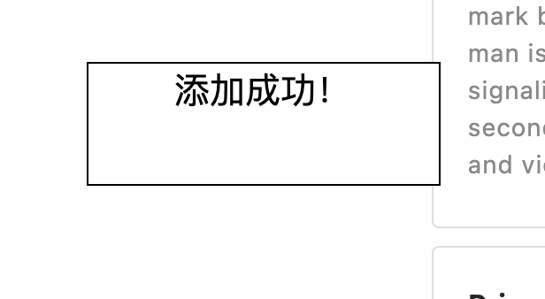
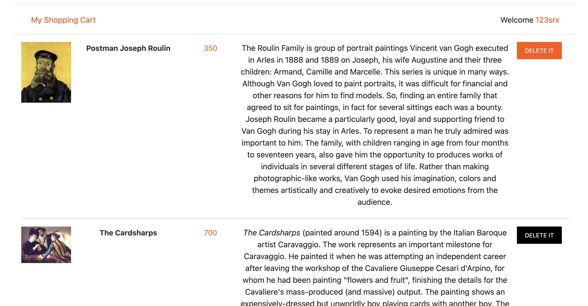
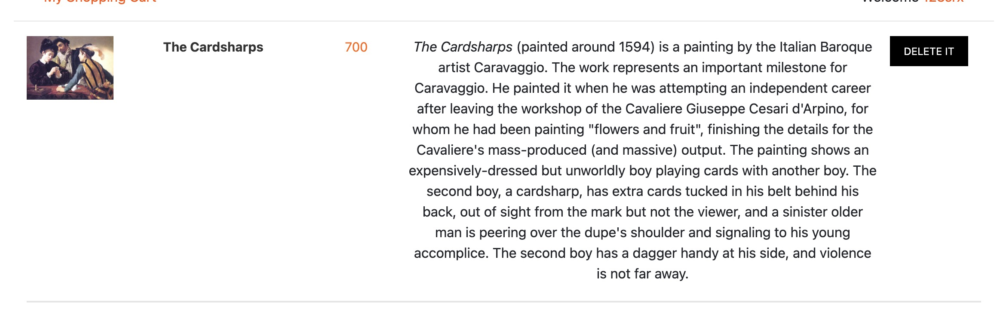
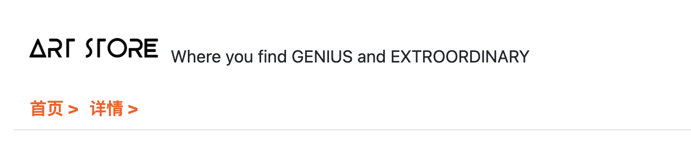

# Lab3 js之中场对决

### 需求介绍

1. 目标：lab3的目标是考察js的基本运用。

2. 内容：需要完成：**商品展示页**、**登录页**、**注册页**、**个人收藏页**的简单js交互。

3. 前置条件：已完成lab2的所有需求

5. Deadline：**2021.4.21 23:59**

5. 提交方式：

   * 代码提交：直接在 lab2的代码上进行修改，更新至你的github账户下的`SOFT130002_pj`仓库
   * 录制交互小视频/gif，打包上传至elearning作业提交处，压缩包命名方式：`学号_lab3`。小视频/gif可分多段录制，也可一起录制，或者分为每个页面一起录制（较为推荐），录制内容需要包含此文档**评分条件**中包含的**每一条交互行为**（除附加的足迹外）; 如实现了足迹栏，单独录制：从首页开始，点入某艺术品详情，进入搜索，回到首页的足迹栏变化情况。
   * 注：以上需要在ddl前完成，**每迟一天扣除5%的成绩**。

### 详细界面要求

1. **商品展示页（5）**

   商品展示页已有一个用于点击收藏的按钮/链接，在点击此按钮后需要弹出“添加成功”的提示。

   注：本lab中的**所有提示框**都可以直接使用alert框弹出，也可以自己写一个自己喜欢的弹出框样式，例图如下：

   

2. **登录页(15)**

   在输入账户为空/密码为空后点击登录按钮，会弹出一个错误提示。

   在输入一个任意的非空账户与非空密码后点击登录按钮，会弹出一个登录成功的提示（此处因为不涉及后台数据交互，所以省略了验证账户和密码是否真的匹配的环节，我们将在之后的lab中完善这一点）。

   注：提示的具体文字可以自己定义，表达相关意思即可，提示的形式也可以自己定义（弹出框或者直接显示在input框旁边都可）。

3. **注册页(20)**

   在注册页输入昵称、密码、确认密码三项中至少有一项为空时，点击注册按钮后，弹出错误提示。

   在注册页输入昵称、密码、确认密码都非空，但密码和确认密码不一致，点击注册按钮后，弹出错误提示。

   在注册页输入昵称、密码、确认密码都非空，密码和确认密码一致，但是不符合既有数字又有字母的格式时，点击注册按钮后，弹出错误提示。

   在注册页输入昵称、密码、确认密码都非空，密码格式符合要求，点击注册按钮后，弹出注册成功提示。

   注：提示的具体文字可以自己定义，表达相关意思即可，提示的形式也可以自己定义（弹出框或者直接显示在input框旁边都可）。

4. **个人收藏页(20)**

   实现对收藏页面物品的删除操作，对已在收藏页中的每个艺术品添加一个“删除”按钮，点击此按钮后，这个艺术品会从页面中消失。

   图例：点击删除按钮前

   ​	

   

   点击按钮后

   

5. **附加功能-足迹（15）**

   实现在每个页面的导航栏位置下面的**足迹栏**，足迹栏可以呈现用户访问网站的足迹。

   如：用户从首页进入商品详情页面，则足迹栏显示“首页->详情“；之后用户点击搜索进入搜索页面时，足迹栏显示“首页->详情->搜索“，若此时用户又点入一个图片的详情界面时，足迹栏显示“首页->详情“，若用户再次进入首页，则足迹栏显示“首页”。足迹栏只需要记录上限3个最近历史足迹，并且足迹栏中的条目可以点击并进入相应页面。

   

   

### 评分要求

1. 商品展示页（5分）

   | 要求             | 分值 | 备注                             |
   | ---------------- | ---- | -------------------------------- |
   | 醒目的Logo和标语 | 5    | 位置，字体，大小，形式均不作限制 |
   
2. 登录页（15分）

   | 要求                           | 分值 | 备注                             |
   | ------------------------------ | ---- | -------------------------------- |
   | 可以验证账户为空的情况         | 5    | 位置，字体，大小，形式均不作限制 |
   | 可以验证密码为空的情况         | 5    | 同上                             |
   | 正确的账户密码输入时有成功提示 | 5    | 同上                             |
   
3. 注册页（20分）

   | 要求                                                       | 分值 | 备注                             |
   | ---------------------------------------------------------- | ---- | -------------------------------- |
   | 可以验证输入昵称、密码、确认密码三项中至少有一项为空的情况 | 5    | 位置，字体，大小，形式均不作限制 |
   | 可以验证密码和确认密码不一致的情况                         | 5    | 同上                             |
   | 可以验证密码不符合既有数字又有字母的格式的情况             | 5    | 同上                             |
   | 对正确的信息点击注册后提示成功                             | 5    | 同上                             |
   
4. 个人收藏页（20分）

   | 要求                                                         | 分值 | 备注               |
   | ------------------------------------------------------------ | ---- | ------------------ |
   | 每个收藏品旁边有“删除”按钮，且鼠标滑过按钮时有高亮变化       | 5    | 无                 |
   | 点击某收藏品的“删除”按钮后，该艺术品会从个人收藏页的界面上消失 | 15   | 不要求持久化的消失 |

5. 足迹栏-附加分（15分）

   | 要求               | 分值 | 备注 |
   | ------------------ | ---- | ---- |
   | 足迹栏的正确更新   | 10   |      |
   | 足迹栏中条目的跳转 | 5    |      |

   